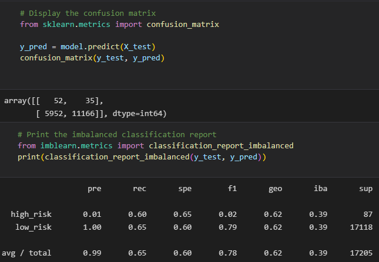

# Credit_Risk_Analysis

## Overview of Project

In 2019, more than 19 million Americans had at least one unsecured personal loan. That's a record-breaking number! Personal lending is growing faster than credit card, auto, mortgage, and even student debt. With such incredible growth, FinTech firms are storming ahead of traditional loan processes. By using the latest machine learning techniques, these FinTech firms can continuously analyze large amounts of data and predict trends to optimize lending. 

In this project, we use python to build and evaluate several machine learning  models to predict credit risk which can help banks and financial institutions predict anomalies, reduce risk cases, monitor portfolios, and provide recommendations on what to do in cases of fraud.

## Analysis Reports Used to Predict Credit Risk

1. Classification Report assessed the performance of two ensemble algorithms; training a Balanced Random Forest Classifier and an Easy Ensemble AdaBoost classifier; each algorithm Ensemble Classifiers Generate used the imbalanced_classification_report from imbalanced-learn.

2. Resample Model: used the SMOTEENN algorithm SMOTEENN Algorithm

3. Oversampling Models: naive random oversampling algorithm and the SMOTE algorithm

4. Undersample Model: Cluster Centroids algorithm

## Resources

- Data Source: Module-17-Challenge-Resources.zip and LoanStats_2019Q1.csv

- Data Tools: credit_risk_resampling_starter_code.ipynb and credit_risk_ensemble_starter_code.ipynb.

- Software: Python 3.9, Visual Studio Code 1.50.0, Anaconda 4.8.5, Jupyter Notebook 6.1.4 and Pandas

- NumPy, version 1.11 or later

- SciPy, version 0.17 or later

- Scikit-learn, version 0.21 or later

- imbalanced-learn package in our mlenv environment.

## Terminology and Formulas

Accuracy score = number of correct prediction/total number of predictions.

Precision = True Positive / (True Positive + False Positive)

Recall = True Positive / (True Positive + False Negative)

FI SCORE is weighted average of the true positive rate (recall) and precision, where the best score is 1.0. Equation: F1 score = 2(Precision x Sensitivity) / (Precision + Sensitivity) 

# Results:

## Resampling Models to Predict Credit Risk

### Oversampling

### Undersampling

Used the undersampling algorithm to verify which algorithm has the best perfomance compared to oversampling above.

## Over/Under Sampling: SMOTEENN

## Ensemble Classifiers

Below is a comparison between two ensemble algorithms to determine the model with the best performance, Balanced Random Forest Classifier and an Easy Ensemble AdaBoost classifier.

### Analysis

The Ensemble Classifier turned out to be the most efficient as it has the highest score for all risk loans. Utilizing Easy Ensemble Classifier will perform a High-Risk loan precision as a great value for the overall analysis. 
Precision for all four models is 0.01 for high-risk loans and 1.00 for low-risk loans. Low precision scores for high-risk loans are based on the large number of false positives, meaning that many of low-risk loans were marked as high-risk loans. High score for low-risk loans indicates that nearly all low-risk scores were marked correctly

The F1 score characterized as a single summary statistic of precision and sensitivity. For the ensemble the high-risk 0.07 and low risk is 0.95 occurs when the sensitivity is very high, while the precision is very low. We have a trade-off between sensitivity and precision, and that a balance must be struck between the two. A useful way to think about the F1 score is that a pronounced imbalance between sensitivity and precision will yield a low F1 score. Having a precision or recall value as 0 is not desirable and hence it will give us the F1 score of 0 (lowest). 

The ensemble models demonstrated more accuracy than the other four models. However, they might be vulnerable to overfitting which may alter the results. Utilizing the metrics, the Confusion Matrix, Precision-Recall, and F1 Score, were vital in refining the evaluation of the model’s performance. Suggestions for future would be to evaluate using a different data set or using other machine learning algorithms.
